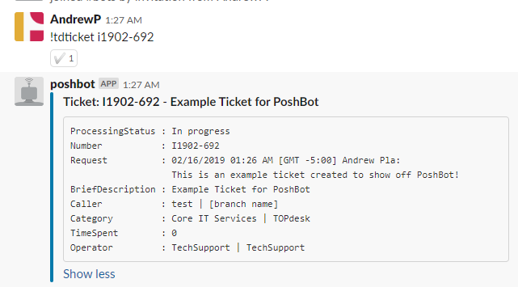
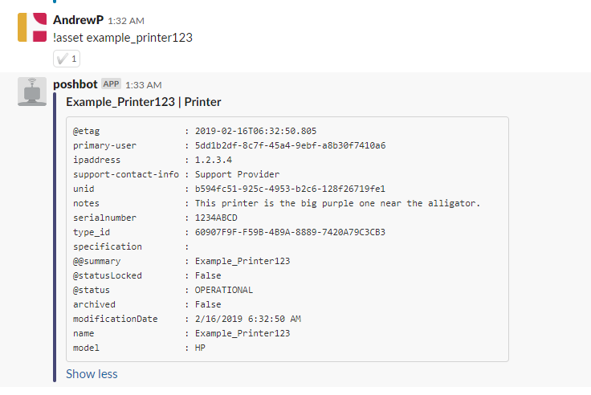

# PoshBot.TOPdesk
PoshBot plugin to return TOPdesk incidents and assets.

This module currently provides 2 commands: Get-TdIncident and Get-TdAsset

## What does it do?

`Get-TdIncident`, or `!TdTicket` returns incidents



Use `!TdTicket -op operatorEmail@company.net` to return a list of all current incidents for the operator. This is a great way to see a list of all currently assigned incidents.

`Get-TdAsset` Returns assets



# Requirements

This module requires the TOPdeskPS powershell module to communicate with TOPdesk. TOPdeskPS also utilizes psframework

## Configure PoshBot for TOPdeskPS

TOPdeskPS requires you provide credentials into the Poshbot configuration file. This is detailed in my post INSERTPOSTHERE

### Create the propert TOPdesk Operator

Create an operator with APi access and read access to Incident Management and Asset Management. Add the operator to the appropriate operator groups. Then generate an api key for that user. This is the operator account that will be performing our topdesk api queries.

### Add the TOPdesk plugin configuration

This configuration needs to be created as the same user account that will run PoshBot.

```
$myCred = Get-Credential # Username is the username of the operator account created for this. password is the apikey
$pbc = Get-PoshBotPlugin
$pbc.PluginConfiguration = @{
      'PoshBot.TOPdesk' = @{
        Credential = $myCred
        Url = 'https://company.topdesk.net'
        ApplicationPassword = $true # I recommend using an application password
    }
}
$pbc | Save-PoshBotConfiguration -Path ~/.poshbot/bot.psd1

```

This assumes that you will be using the configuration file stored in ~/.poshbot/bot.psd1 when you call Start-Poshbot like this: `Get-PoshBotConfig -Path ~/.poshbot/bot.psd1 | Start-Poshbot`

See the PoshBot docs at [http://docs.poshbot.io/en/latest](http://docs.poshbot.io/en/latest)
